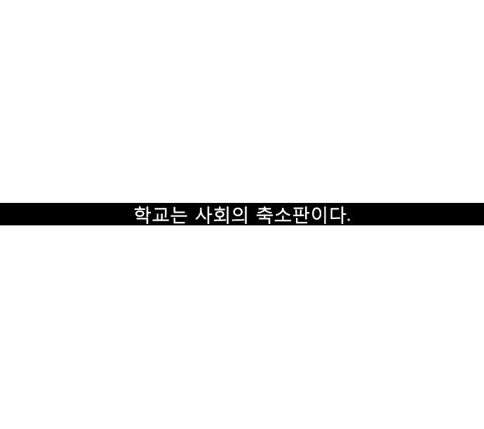

# bubble-detector
This is a bubble detector from a webtoon.

This is a Python utility designed to slice a vertically-scrolling webtoon into its constituent panels and  also detects conversation bubbles within each panel. The tool uses OpenCV for image processing and relies on grayscale conversion for efficient slicing and uses yolov8 to detect bubbles

# Slicing Logic

1. Row Iteration and Panel Slicing
The main loop iterates through each row of pixels, slicing the webtoon into panels based on 'empty' rows that serve as delimiters.

2. Check for Empty Rows
A row is considered 'empty' if it meets certain intensity criteria (e.g., almost black or almost white pixels). This can be adjusted.

# Example

Original image is located at [Here](sample/image/prologue.jpg)

# Bubble Generation

Automatically generates bubbles and paste them onto random sliced images and keep annotations

# Bubble detection

## TODO List

- [x] Panel Slicing
- [x] Dataset Creation
- [ ] Add Conversation Bubble Detection feature
- [ ] Add OCR feature
- [ ] Add Translation feature
- [ ] Add user-friendly CLI or GUI

